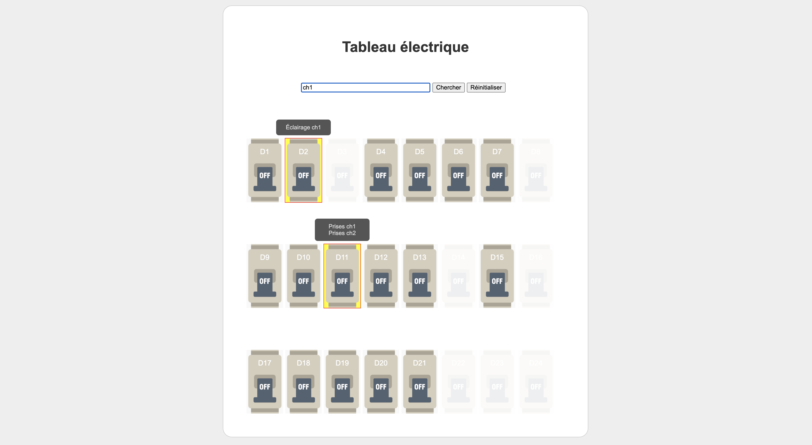

# Tableau Électrique

Ce projet propose une interface web interactive pour visualiser un tableau électrique. Il permet de :

- Visualiser les disjoncteurs répartis sur plusieurs lignes.
- Afficher des informations détaillées sur chaque disjoncteur au survol.
- Rechercher un disjoncteur à l'aide d'un mot-clé.
- Réinitialiser la recherche avec un bouton ou la touche `Escape`.



## Fonctionnalités

### Visualisation dynamique
- Le tableau électrique est généré dynamiquement à partir d'un fichier JavaScript contenant les données des disjoncteurs.
- Les disjoncteurs désactivés sont identifiés par une opacité réduite.

### Recherche
- Un champ de recherche permet de filtrer les disjoncteurs en fonction des mots-clés.
- Les résultats de la recherche sont mis en évidence avec une couleur de fond jaune et une bordure rouge.
- La recherche peut être réinitialisée avec un bouton ou en appuyant sur la touche `Escape`.

### Informations détaillées
- Au survol d'un disjoncteur, une popup affiche les informations associées (prise, éclairage, etc.).

## Installation

1. Clonez ce dépôt :
   ```bash
   git clone <url-du-repo>
   ```

2. Ouvrez le fichier `index.html` dans un navigateur web.

## Structure des données

Les données du tableau électrique sont définies dans un tableau JavaScript, sous la forme suivante :

```javascript
const tableauData = [
    [
        { id: "D1", info: "Prises salon", disabled: false },
        { id: "D2", info: "Éclairage cuisine", disabled: false },
        { id: "D3", info: "N/A", disabled: true },
        // ... autres disjoncteurs
    ],
    // ... autres lignes
];
```

- **id** : Identifiant unique du disjoncteur.
- **info** : Informations affichées dans la popup.
- **disabled** : Si `true`, le disjoncteur est désactivé visuellement.

## Personnalisation

### Modifier les données

- Pour ajouter ou modifier des disjoncteurs, mettez à jour le tableau `tableauData` dans le fichier principal.

### Styles

- Les styles CSS sont définis dans une section `<style>` du fichier `index.html`.
- Vous pouvez personnaliser les couleurs, tailles et apparences des éléments.

## Contributions

Les contributions sont les bienvenues. Veuillez ouvrir une **issue** ou soumettre une **pull request** pour toute suggestion ou amélioration.

## Licence

Ce projet est sous licence MIT. Voir le fichier [LICENSE](LICENSE) pour plus de détails.
